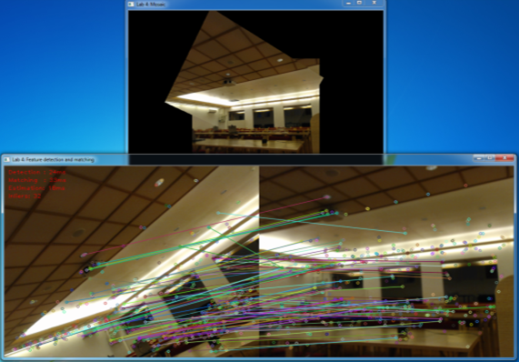

# labvision
Weekly computer vision exercises

## Computer Vision

### Feature Matching

  <b>Feature Matching</b> 
  
   

### Machine Learning

SIFT - SURF model

### Deep Learning

TensorFlow - OpenCV
